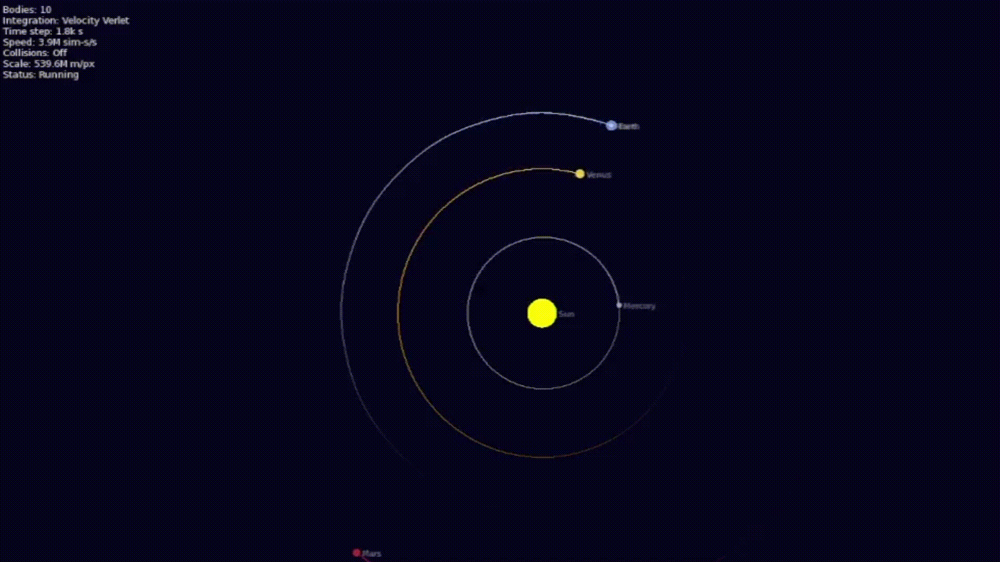
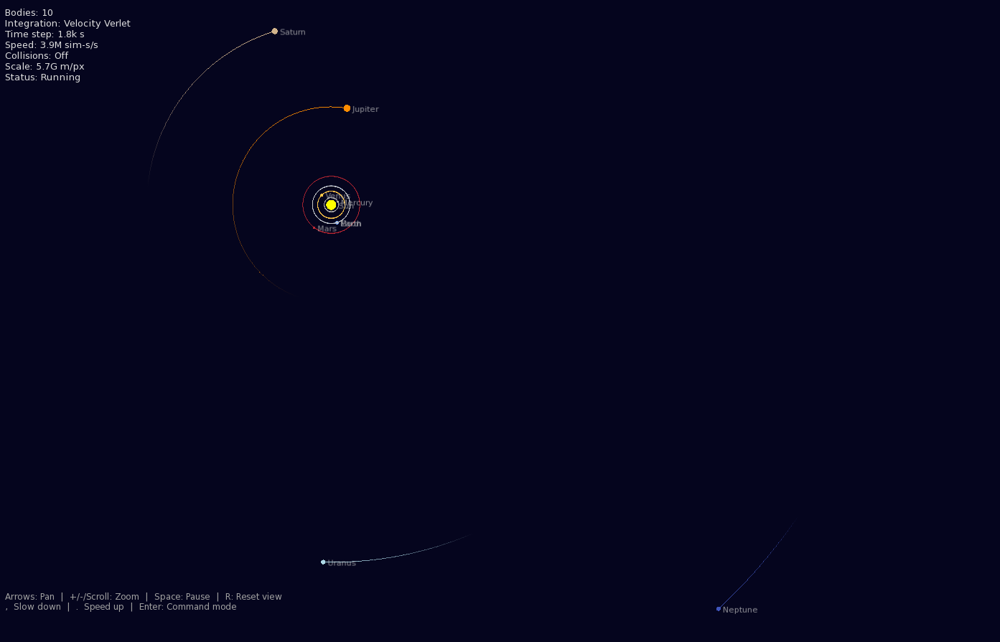
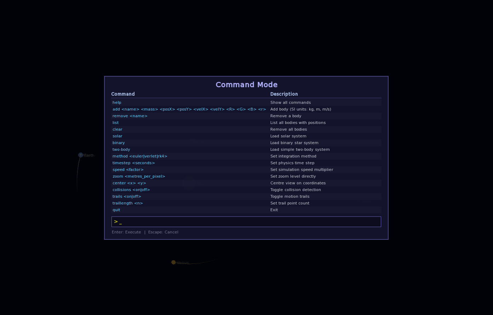
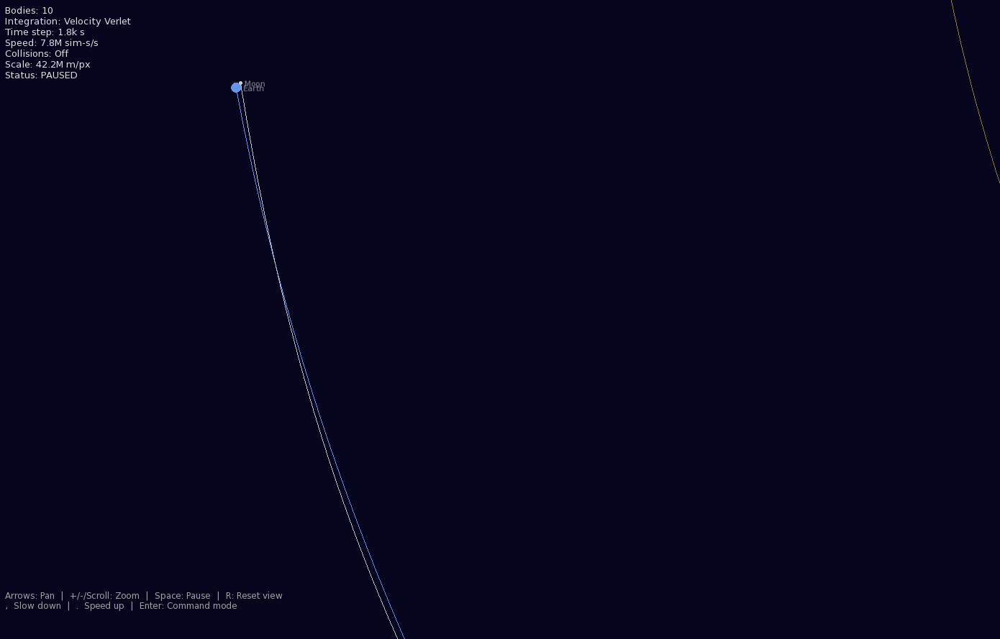

# Gravity Simulator

A C++ N-body physics simulation that visualises gravitational interactions between celestial bodies using Newton's laws of universal gravitation, with multiple numerical integration methods and real-time SFML rendering.

<p align="center">
  
</p>

## Features

- **Real SI-unit physics** — All calculations run in metres, m/s, and kg. Rendering converts to screen space only at draw time.
- **Coupled N-body integration** — All bodies advance together at each integration sub-step, so mutual interactions are computed correctly.
- **Double-precision physics** — Custom `Vec2` type avoids float precision loss across astronomical scales. SFML floats are only used for final pixel positions.
- **Three integration methods** — Euler, Velocity Verlet (default, symplectic), and Runge-Kutta 4.
- **Gravitational softening** — ε² softening prevents numerical singularities during close encounters.
- **Fixed-timestep accumulator** — Physics steps are decoupled from frame rate, preventing simulation instability from frame drops.
- **Camera system** — Pan with arrow keys, zoom with scroll wheel or +/- keys. Scroll zoom targets the mouse cursor position.
- **Simulation speed control** — Speed up or slow down with `,` / `.` keys, or set an exact multiplier via command.
- **Collision handling** — Optional momentum-conserving mergers with mass-weighted colour blending.
- **Motion trails** — Circular `std::deque` buffer with configurable length and fading effect.
- **On-screen command mode** — Press Enter to open a command overlay showing all available commands in a table. Feedback is displayed on screen.
- **Font fallback chain** — Tries multiple system font paths across Linux, macOS, and Windows.
- **Pre-configured scenarios** — Solar system (Sun through Neptune + Moon), binary star system, and two-body orbit.

---

## Setup

### 1. Install SFML

**Ubuntu / Debian:**
```bash
sudo apt update
sudo apt install libsfml-dev build-essential cmake
```

**Fedora:**
```bash
sudo dnf install SFML-devel gcc-c++ cmake
```

**Arch Linux:**
```bash
sudo pacman -S sfml gcc cmake
```

**macOS (Homebrew):**
```bash
brew install sfml cmake
```

**Windows (vcpkg):**
```powershell
vcpkg install sfml
```

### 2. Build and Run

```bash
cd GravitySimulator
rm -rf build && mkdir build && cd build
cmake ..
make -j$(nproc)
./gravitysim
```

The simulation starts with the solar system by default.

<p align="center">
  
</p>

---

## Controls

| Key | Action |
|---|---|
| Arrow keys | Pan view |
| `+` / `-` | Zoom in / out |
| Mouse scroll | Zoom toward cursor |
| `,` | Slow down simulation |
| `.` | Speed up simulation |
| `R` | Reset view to origin |
| `Space` | Pause / Resume |
| `Enter` | Open command mode |
| `Esc` | Close command mode or quit |

## Command Mode

Press `Enter` to open the command prompt. Available commands:

<p align="center">
  
</p>

| Command | Description |
|---|---|
| `help` | Show all commands |
| `add <name> <mass> <posX> <posY> <velX> <velY> <R> <G> <B> <radius>` | Add body (SI units: kg, m, m/s) |
| `remove <name>` | Remove a body |
| `list` | List all bodies with positions |
| `clear` | Remove all bodies |
| `solar` | Load solar system |
| `binary` | Load binary star system |
| `two-body` | Load simple two-body system |
| `method <euler\|verlet\|rk4>` | Set integration method |
| `timestep <seconds>` | Set physics time step |
| `speed <factor>` | Set simulation speed multiplier |
| `zoom <metres_per_pixel>` | Set zoom level directly |
| `center <x> <y>` | Centre view on coordinates |
| `collisions <on\|off>` | Toggle collision detection |
| `trails <on\|off>` | Toggle motion trails |
| `traillength <n>` | Set trail point count |
| `quit` | Exit |

### Example: Adding a Custom Body

```
add Asteroid 1e20 300e9 0 0 20e3 255 128 0 3
```

This adds a body named "Asteroid" with mass 10²⁰ kg at position (300 billion m, 0) with velocity (0, 20 km/s), orange colour, and 3px display radius.

<p align="center">
  
</p>

---

## Architecture

```
GravitySimulator/
├── include/
│   ├── Vec2.hpp              # Double-precision 2D vector
│   ├── CelestialBody.hpp     # Body with physics state + rendering
│   ├── GravitySimulator.hpp  # N-body physics engine
│   └── Scenarios.hpp         # Pre-configured simulations
├── src/
│   ├── main.cpp              # Application, camera, HUD, commands
│   ├── CelestialBody.cpp     # Body implementation
│   ├── GravitySimulator.cpp  # Integrators + collision handling
│   └── Scenarios.cpp         # Solar system, binary, two-body
├── CMakeLists.txt
├── Makefile.mak
└── README.md
```

### Technical Details

**Physics vs display separation**: All physics runs in real SI units. The `metersPerPixel` camera parameter converts world coordinates to screen pixels only at render time, so gravitational force calculations are physically correct.

**Integration methods**: Euler is fastest but least accurate. Velocity Verlet is the default — it's symplectic, giving good long-term energy conservation for orbital mechanics. RK4 is most accurate for smooth trajectories but most expensive (4x force evaluations per step).

**Softening**: A softening length (default 10⁶ m) is added to distance calculations to prevent force singularities. The force law uses the conservative form `G·m·r / (r² + ε²)^(3/2)`, which is the exact gradient of the softened potential, preserving Verlet's symplectic properties.

---

## Troubleshooting

**No text visible**: The program tries several system font paths. If none work, text won't render but the simulation still runs. Install `fonts-dejavu-core` (Ubuntu) or place `arial.ttf` in the working directory.

**Orbits fly apart**: The default timestep (1800s) works well for the solar system. For smaller or tighter systems, try `timestep 60` or `timestep 10`. Also try `method rk4` for better accuracy.

**Simulation runs slowly**: Reduce trail length (`traillength 50`) or switch to `method euler`.
